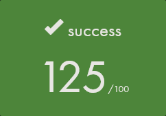

# FdF - Wireframe Renderer

## Overview
FdF (Fil de Fer, "wireframe" in French) is a 42 school project introducing the fundamentals of computer graphics. The program renders wireframe models from height maps, creating a 3D visualization on a 2D screen through various projection techniques.


## Features
- Multiple projection modes (isometric, side view, top-down)
- Interactive 3D model manipulation (rotation, zoom, translation)
- Z-scaling for altitude emphasis
- Color gradients based on elevation
- Support for custom input colors

## Installation
The project uses the [MLX42 library](https://github.com/codam-coding-college/MLX42) which is included as a git submodule and automatically initialized by the Makefile.

```bash
# Clone the repository and cd into it
git clone https://github.com/alimnaqvi/FdF
cd FdF

# Compile the project
make
```

## Usage
```bash
./fdf <path to .fdf file>
```

### Map Format
Maps (.fdf files) contain space-separated integers representing a grid of points in 3D space:
- Position in the line (horizontally) represents the X coordinate
- Line number (vertically) represents the Y coordinate
- Integer value represents the Z coordinate (altitude/height)
- Optional color can be specified in hexadecimal after a comma (e.g., `10,0xFF0000`)

Example of a simple map file (3x3 grid):
```
0  0  0
0  10 0
0  0  0
```

Example with custom colors:
```
0,0xFF0000  0,0x00FF00  0,0x0000FF
0,0xFFFF00  10,0xFF00FF  0,0x00FFFF
0,0xFFFFFF  0,0x000000  0,0x888888
```

### Controls
| Action                     | Control                                    |
| -------------------------- | ------------------------------------------ |
| Close program              | ESC                                        |
| Move map                   | Arrow keys                                 |
| Zoom                       | Mouse scroll wheel                         |
| Rotate around X-axis       | Q, E                                       |
| Rotate around Y-axis       | A, D                                       |
| Rotate around Z-axis       | W, S                                       |
| Increase/decrease altitude | SHIFT + Up/Down arrow                      |
| Switch projection          | 1 (Isometric), 2 (Side view), 3 (Top-down) |
| Toggle color scheme        | C                                          |
| Reset to default view      | R                                          |

## Example Maps
Sample maps are included in the `maps/` directory. Try them out, e.g.:
```
./fdf maps/pyramide.fdf
./fdf maps/42.fdf
```

## Technical Concepts Learned

### Computer Graphics Fundamentals
- **3D-to-2D Projection**: Converting coordinates from 3D space to 2D screen space using mathematical transformations
- **Matrix Operations**: Applying rotation, translation, and scaling through matrix transformations
- **Isometric Projection**: Creating a pseudo-3D view by using an equal angle for all three axes
- **Perspective**: Understanding how objects further away appear smaller

### Line Drawing Algorithms
- **DDA (Digital Differential Analyzer)**: Efficient line drawing algorithm based on incremental calculations
- **Bresenham's Algorithm**: Optimized integer-based line drawing algorithm (implemented but not used in final version)
- **Line Interpolation**: Calculating intermediate points between two endpoints

### Color Management
- **RGB/Hex Color Representation**: Working with different color formats
- **Color Interpolation**: Creating smooth transitions between colors based on elevation
- **Bit Manipulation**: Using bit shifts for efficient color transformation and transparency handling

### Software Engineering Practices
- **Memory Management**: Creating a custom garbage collector to prevent memory leaks
- **File Parsing**: Reading and processing formatted input files
- **Modular Design**: Organizing code into specialized components
- **Error Handling**: Robust validation of inputs and handling of edge cases
- **Git Submodules**: Managing external dependencies effectively

### User Interface
- **Event Handling**: Capturing and responding to user input for interactive manipulation
- **Real-time Rendering**: Continuously updating the display based on user actions

## Acknowledgments
- Thanks to the creators of [MLX42 library](https://github.com/codam-coding-college/MLX42) for creating this well-documented and performant library that is a joy to use and is optimal for introduction to computer graphics.
- 42 School for the challenging project that provides hands-on experience with fundamental computer graphics concepts.


